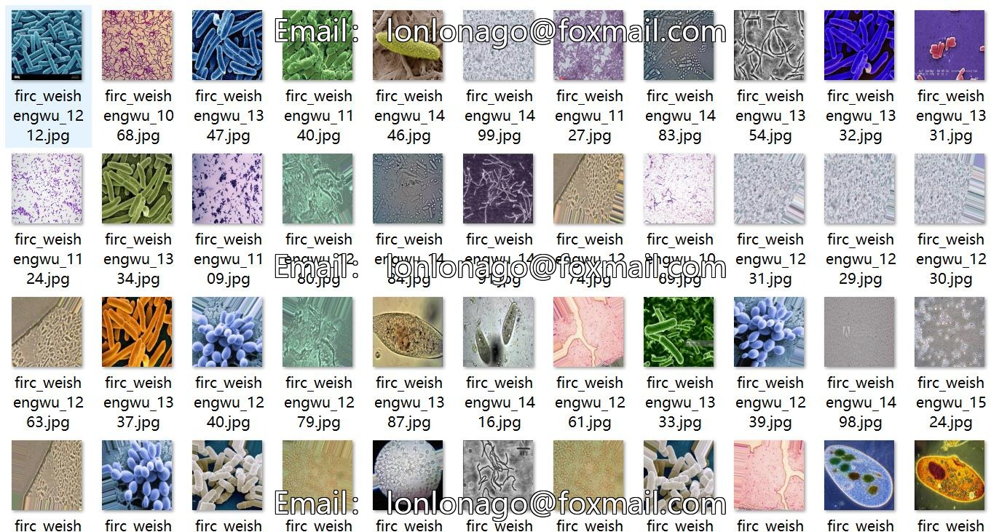
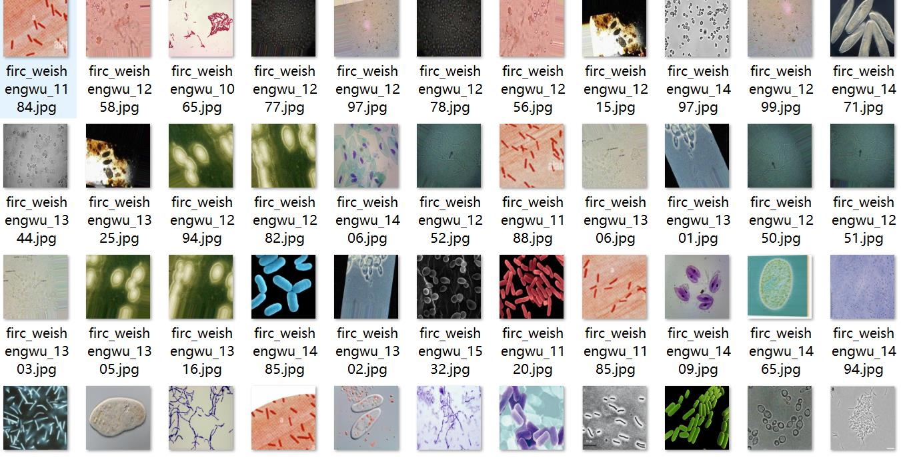
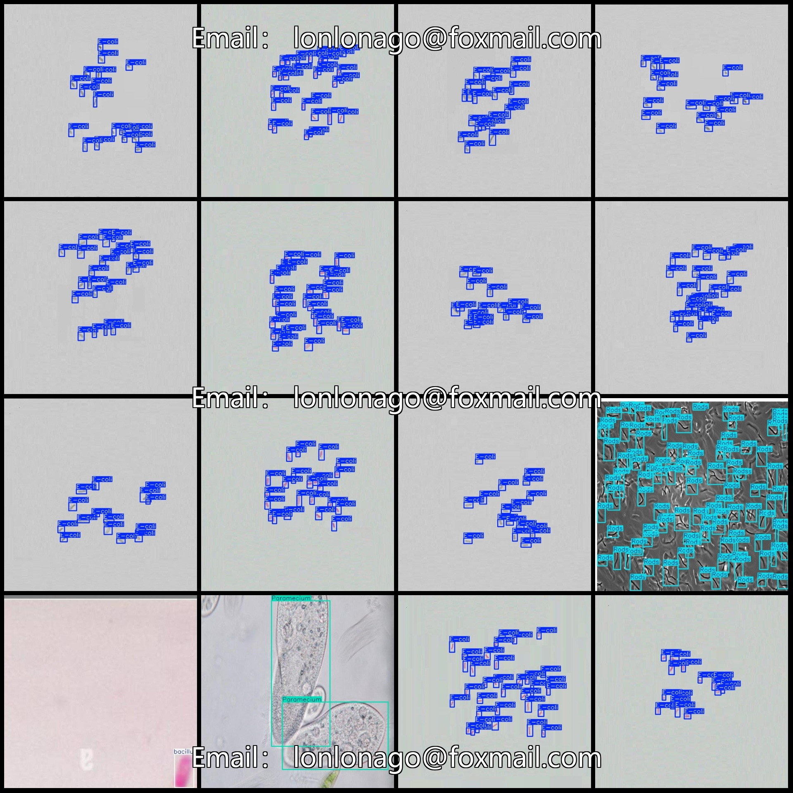

# Microorganism Micro-imaging Target Detection Dataset VOC+YOLO Format 1534 Images in 6 Classes

Dataset format: Pascal VOC format + YOLO format (without split path in the txt file, only including jpg images and corresponding VOC format xml files and yolo format txt files)

Number of images (jpg file count): 1534
Number of annotations (xml file count): 1534
Number of annotations (txt file count): 1534
Number of categories: 6
Repository: firc-dataset
Annotation category names: ["E-coli", "Paramecium", "Rods", "Yeast", "bacillus", "coco"]
Boxes per category:
- E-coli (Escherichia coli) boxes = 22008
- Paramecia (Paramecium) boxes = 427
- Rods (Bacillus) boxes = 620
- Yeast (Saccharomyces cerevisiae) boxes = 2837
- Bacillus (Bacillus subtilis) boxes = 1252
- Coco (Candida albicans) boxes = 783
Total boxes: 27927
Image resolution: 640x640
Used labeling tool: labelImg
Labeling rules: draw rectangle boxes for each category
Important note: No specific statement provided at this time.
Special declaration: This dataset does not guarantee the accuracy of trained models or weight files.
Image preview:
## Images

Here is a pay link on Stripe ( https://buy.stripe.com/3cs8yP7sY87d0vu9AB ). Please contact me lonlonago@foxmail.com after funding $89, and I will send you a complete data files , thank you!

